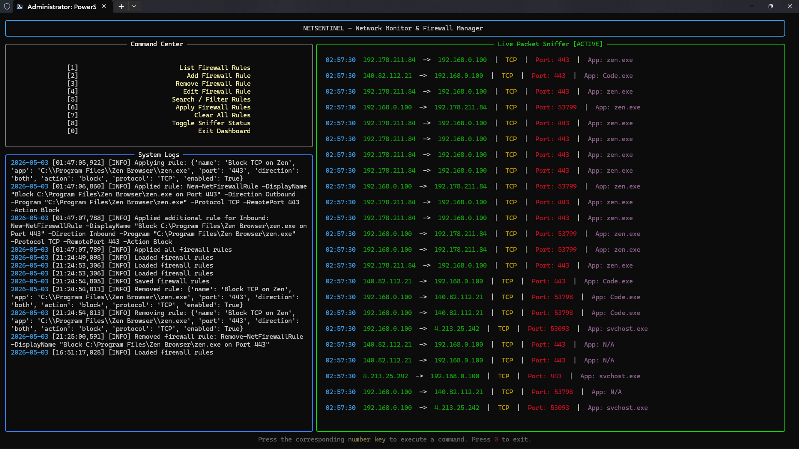

# NetSentinel: A Windows Firewall Management Tool

NetSentinel is a Python-based utility designed to explore Windows firewall management and network traffic monitoring. Originally built as a fourth-semester college project, it’s a learning project to understand how firewalls work, & not a production-ready solution. 

It provides an interactive dashboard to monitor live network packets and a command-line interface to dynamically inject blocking rules into the Windows Defender Firewall.



## Features

- **Application-Layer Firewall Management**: Add, edit, remove, or search rules to block specific `.exe` applications, IPs, or ports using Windows Defender Firewall via PowerShell.
- **Real-Time Packet Sniffing**: Uses `scapy` to monitor network traffic (TCP, UDP, ICMP, ARP) and dynamically maps inbound/outbound packets to running local processes.
- **Interactive TUI Dashboard**: A polished `rich` based terminal interface that displays live system logs and a scrolling packet feed with hotkey navigation.
-- **Firewall Rule Domain Model**: Firewall rules are represented by a dedicated FirewallRule dataclass, providing a consistent structure across the UI, persistence, and firewall layers.
- **Decoupled Architecture**: Strictly separated modules for UI, Network, Security, and Core Data to prevent circular dependencies and ensure maintainability.
- **Persistent State**: Firewall rules are saved and loaded dynamically from a local JSON database, ensuring protection persists across reboots.
-- **Connection-Aware Process Mapping**: Uses a background connection cache to efficiently map captured packets to local processes without repeatedly scanning active connections.

## Requirements

- **OS:** Windows 10 / 11 (Requires Administrator privileges for OS-level firewall modifications).
- **Python:** 3.8+
- **Dependencies:** `scapy`, `psutil`, `rich` 
- Npcap or WinPcap (required by Scapy for Windows network capture).

## Installation & Setup

1. **Clone the repository:**
   ```bash
   git clone https://github.com/yourusername/netsentinel.git
   cd netsentinel
   ```

2. **Install dependencies:**
   ```bash
   pip install -r requirements.txt
   ```
   *(Note: Ensure you have Npcap installed on your Windows machine for packet sniffing).*

3. **Launch the application:**
   Open a terminal **as Administrator** and run:
   ```bash
   python main.py
   ```

## Usage & CLI Commands

By default, running `main.py` launches the interactive TUI Dashboard. You can use the number keys (`1-7`) to manage rules and `8` to toggle the packet sniffer on or off.

You can also bypass the dashboard and execute one-shot commands directly via the CLI:

- `python main.py --add` : Launch the interactive prompt to create a new firewall rule.
- `python main.py --remove` : Remove an existing rule.
- `python main.py --edit` : Edit an active firewall rule.
- `python main.py --search` : Filter and search through active rules.
- `python main.py --list` : Display a formatted table of all active rules.
- `python main.py --apply` : Push all configured rules in the database to Windows Defender.
- `python main.py --clear` : Flush all NetSentinel rules from the OS.

## Project Architecture

The codebase is organized using a strict separation of concerns to keep the logic clean and maintainable:

```text
netsentinel/
├── main.py             # The entry point and CLI argument parser
├── config.py           # Global state, logging setup, and thread locks
│
├── core/                   
│   ├── models.py       # FirewallRule domain model
│   └── database.py     # JSON storage operations (load/save rules)
│
├── network/        
│   ├── cache.py        # Background port→process cache       
│   ├── sniffer.py      # Background Scapy thread for packet capture
│   └── mapper.py       # Maps network packets to local processes
│
├── security/               
│   └── firewall.py     # PowerShell command builder and OS execution
│
├── ui/                     
│   ├── dashboard.py    # The rich live terminal UI loop
│   └── prompts.py      # Interactive input flows for rule management
│
├── utils/                  
│   ├── admin.py        # Windows privilege escalation checks
│   └── validators.py   # IP and Port validation logic
│
├── firewall.log        # Rule operation and application logs 
└── rules.json          # Persistent firewall rule database


```

## Disclaimer

This tool directly modifies your Windows Defender Firewall rules and intercepts network traffic. It is built as an educational security utility to understand OS networking. Do not deploy on production servers or mission-critical enterprise environments without thorough testing.
